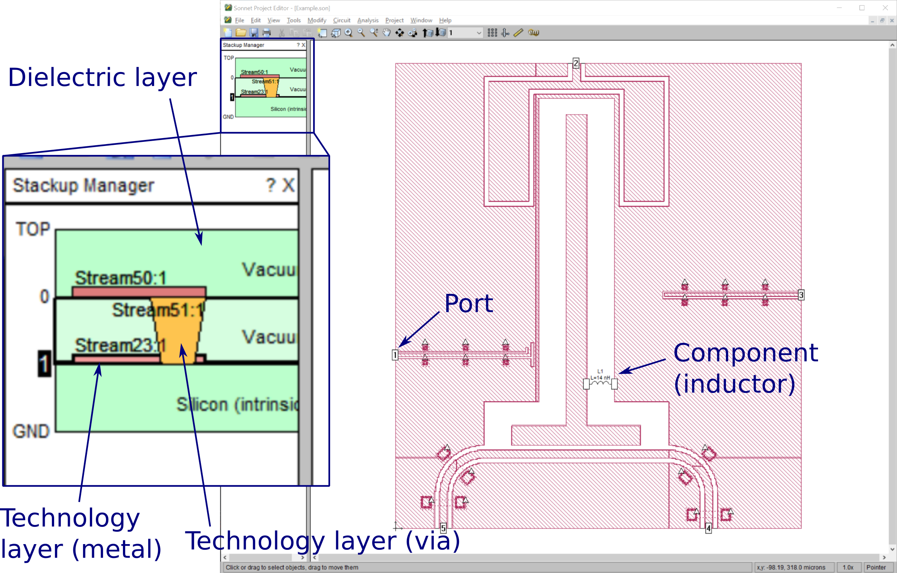

User's guide
============

Introduction
------------

SonPy is a Python package that allows the user to define, manipulate and simulate Sonnet projects. Sonnet is an electromagnetic circuit simluator from `Sonnet Software, Inc. <http://www.sonnetsoftware.com/>`_, which provide both free and commercial versions of the software. Some of the functionality provided by SonPy requires a commercial version, for instance conversion of GDSII files to Sonnet project files.

The goal of SonPy is to replace any interactions between the user and the Sonnet GUI with Python functions, thereby allowing a fully automated circuit design and simulation process with for instance feedback loops based on the results of the simulations.

How can I use SonPy?
---------------------

SonPy was developed with the following usage in mind:

1. The user has a GDSII file (.gds) with the basic circuit design, for instance produced in Python using `gdspy <https://github.com/heitzmann/gdspy>`_. Designing the circuit in Python has the advantage that variables (resonator lengths, port attachment points ect.) can be used later in the script in relation with SonPy/Sonnet.
2. The GDSII file is converted to a Sonnet project file (.son) using SonPy. This requires a Sonnet license that allows gds conversion.
3. The Sonnet project is manipulated (metal properties are set, ports are added, frequency and parameter sweeps are set up ect.) using SonPy.
4. The user runs the Sonnet simulation through SonPy. This requires a Sonnet license that allows the simulation set up by the user (simple simulations without parameter sweeps are allowed in the free version.)
5. Data from the simulation is extracted.
6. Based on the simulation results we may go to step 1 and alter the circuit design.

Simple examples of usage are given in the example Python scripts available in the SonPy GitHub. Please have a look at these to understand the basic setup and usage.

Terminology
-----------

Although the user is assumed to be familiar with Sonnet and chip design lingo, we briefly go through some of the terminology used in Sonnet, SonPy and the Sonnet project file syntax manual [Son15]_. Fig. 1 shows a screenshot from the Sonnet GUI highlighting some typical concepts.

.. [Son15] Sonnet Project Format, Release 16, Sonnet Software Inc. (2015). Can be found `here <http://www.sonnetsoftware.com/support/downloads/manuals/sonnet_project_format.pdf>`_.

   Sonnet terminology illustrated in the Sonnet GUI.

**Dielectric layer** is abreviated *dlayer* in SonPy and indexed 0, 1, 2 ect. starting from the top. They are represented as green slabs in the Sonnet GUI, and are typically vacuum or Silicon. The dielectric layers are the fundamental layers of the system, and everything else (technnology layers, ports and components) reside in a dielectric layer. This means that removing a dielectric layer also removes any technology layers, ports and components associated with that dielectric layer.

**Technology layer** is abreviated *tlayer* in SonPy and is of type *metal*, *via* or *brick*. Metal tlayers are red in the Sonnet GUI and comprised of many polygons that make up most of the actual circuit design. Via tlayers are orange in the Sonnet GUI, and they are typically used to connect two metal layers, thus functioning as bridge pillars in an air bridge. Brick tlayers are blue in the Sonnet GUI and rarely used. Each tlayer is associated with the dlayer in which the tlayer is physically placed (via tlayers are associated to the dlayer in which is starts and also has a data slot for the dlayer it extends to). SonPy assumes that tlayers are mapped from a GDSII file (.gds file) and follow the default naming convention ``StreamX:Y`` with ``X`` the gds stream number and ``Y`` the gds object number. Tlayers are indexed by their gds stream number, i.e. this is the number to input to a SonPy function to modify a specific tlayer.

**Ports** are (usually) placed on the edge of the circuit/the bounding box. They are associated with a dlayer. Sonnet supports different types of ports, but only ports of *standard type* (STD) is implemented in SonPy. In the Sonnet GUI they are represented by a the port number in box.

**Components** can be placed on the circuit to model an ideal *inductor*, *resistor* or *capacitor*. Only components of type *ideal* are implemented in SonPy. Like ports they are associated with a dlayer. In the Sonnet GUI they are represented by a drawing illustrating the component type extending from one point to another. These two points are themselves ports (although not standard ports), but it means adding a components increases the number of ports by two.

The Sonnet GUI provides a nice overview of the stackup and any ports and components in the project. In SonPy the user can get a similar overview by calling the :func:`printLayers()` function. For the project shown in Fig. 1 the function call :func:`printLayers()` prints to the command line::

    ================== TOP ==================

      Dielectric layer:  0 (Vacuum)

    ================= LVL 0 =================

      Dielectric layer:  1 (Vacuum)
      Technology layer:  23 (METAL)
      Technology layer:  50 (METAL)
      Technology layer:  51 (VIA)
      Port:              1 (STD)
      Port:              2 (STD)
      Port:              3 (STD)
      Port:              4 (STD)
      Port:              5 (STD)
      Component:         "L1" (IND)

    ================= LVL 1 =================

      Dielectric layer:  2 (Silicon (intrinsic))

    ================== GND ==================
